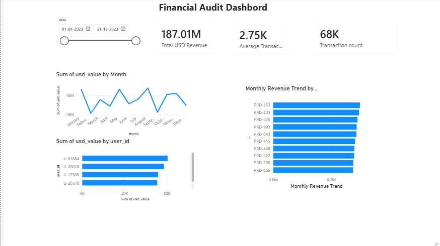

# Enterprise Data Reconciliation & Financial Audit Dashboard

## 📌 Overview
This project involves cleaning and reconciling enterprise data from multiple sources — a database, server logs, and daily exchange rates — into a single unified dataset. The processed data was then used to build an interactive Power BI dashboard for financial audit and business insights.

## 🛠️ Tools & Technologies Used
| Tool | Purpose |
|------|---------|
| Python | Data Cleaning |
| Pandas | Data Processing |
| SQLite | Database Queries |
| Regex | Log Extraction |
| Power BI | Dashboard |

## 📂 Datasets Used
| Dataset | Purpose |
|---------|---------|
| Enterprise Database (.db) | Customer information |
| Server Logs (.txt) | Transaction data |
| Daily Exchange Rates (.csv) | EUR → USD Conversion |

## 🧹 Data Cleaning Process
- Connected to the SQLite database and retrieved the latest user records
- Parsed unstructured server logs using Regex to extract transaction details
- Removed invalid/duplicate records
- Created a clean, structured DataFrame for further processing

## 💱 Currency Conversion
- Loaded daily exchange rates from CSV
- Merged exchange rate data with transaction data
- Calculated the USD value for each transaction using:

  **USD Value = EUR Value × Exchange Rate**

## 📊 Dashboard

The interactive Power BI dashboard includes:
- Total USD Revenue: **187.01M**
- Average Transaction Value: **2.75K USD**
- Total Transaction Count: **68K**
- Monthly Revenue Trend
- Top Revenue-Generating Users
- Top Revenue-Generating Products

## 🔍 Key Insights
- Identified overall revenue trends across the year
